# [2020-2021学年第2学期](https://sigcc.gitee.io/xplatform/#/lab/01/lab01.intro?id=_2020-2021学年第2学期)

# [**实 验 报 告**](https://sigcc.gitee.io/xplatform/#/lab/01/lab01.intro?id=实-验-报-告)


- 课程名称:跨平台脚本开发技术
- 实验项目:JavaScript入门
- 专业班级:计算机1803
- 学生学号:31801150
- 学生姓名:张帅
- 实验指导教师:郭鸣

## [实验目标](https://sigcc.gitee.io/xplatform/#/lab/01/lab01.intro?id=实验目标)

掌握NodeJS, Chrome开发工具的使用，熟悉JavaScript的值与类型系统

## [实验内容](https://sigcc.gitee.io/xplatform/#/lab/01/lab01.intro?id=实验内容)

1. 开发工具使用。

   - 安装[开发工具](https://sigcc.gitee.io/xplatform/#/tools/) Nodejs, Chrome, VS Code, Git

   - 运行node 进入REPL(Read Eval Print Loop) 运行下面的命令

     - .help
- 作用：进入帮助界面，可以查看帮助
     - 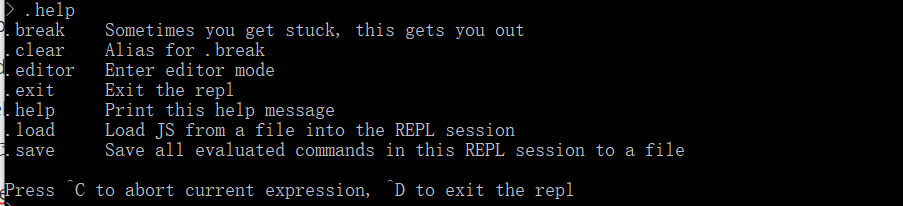
- .load prog.js //事先编辑好 prog.js 文件Fibonacci计算程序
     - 作用：载入js文件
- 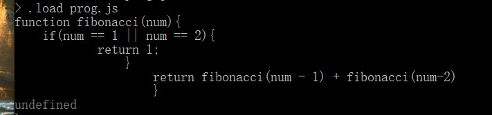
     - .exit
- 作用：退出node.js
  


- node 解释器方式运行教材上的你选任意程序, 将程序保存到prog.js 文件中
  
     - node prog.js
     
     - node debug prog.js
       
       - help 查看 调试器用法
       
     - 练习 run, restart, next, cont, sb(), list(),watch等命令的使用。
     
     
   设置断点(sb())：
   
   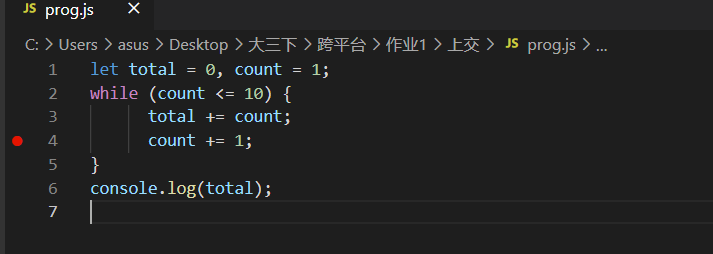
   
   运行（run)：
   
   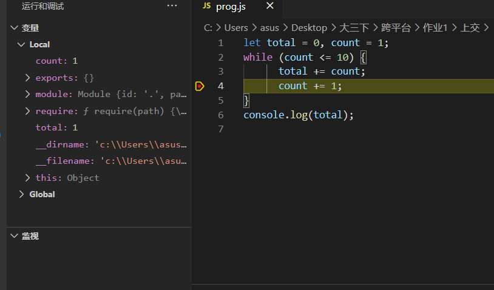
   
   下一步(next)：
   
   
   
   重启(restart):
   
   
   
   执行直到遇到下一个断点(cont):
   
   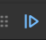
   
   list()没有对应命令，作用：显示当前运行前后的x行代码
   
   添加到监视（watch）：
   
   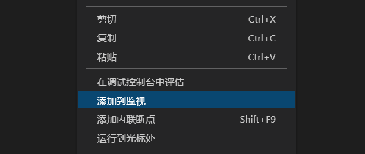
   
   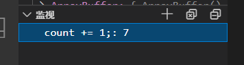
   
   
   
   
   
   - Chrome Devtools 按`ctrl+shift+j/F12` 进入Devtools界面
   
     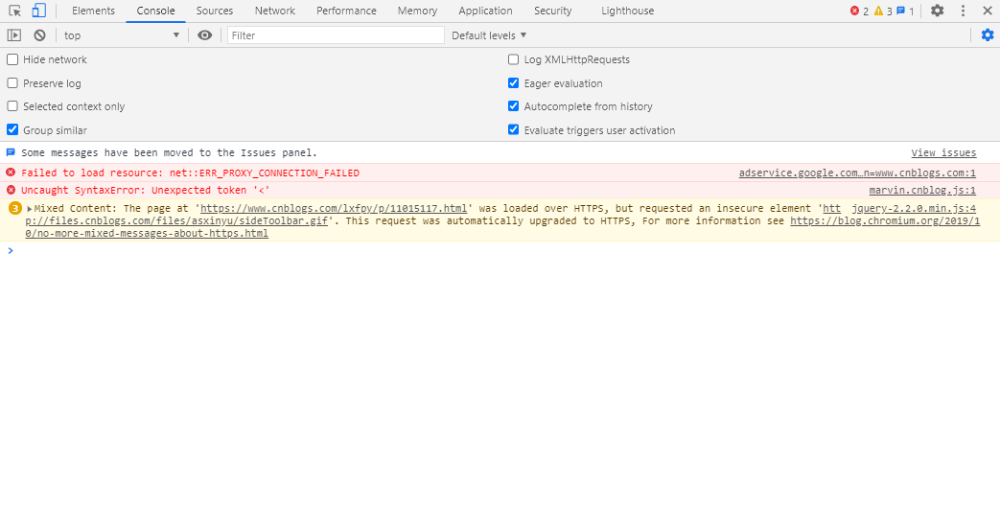
   
   - 建立一个 code.html 文件，内容如下： `<script src='code.js'></script>`
   
     - 建立一个code.js 文件 放置你的代码
     
     - 用Chrome打开 code.html,按 `ctrl+shift+j` 进入Devtools界面，在此界面，可以调试 JavaScript代码
     
       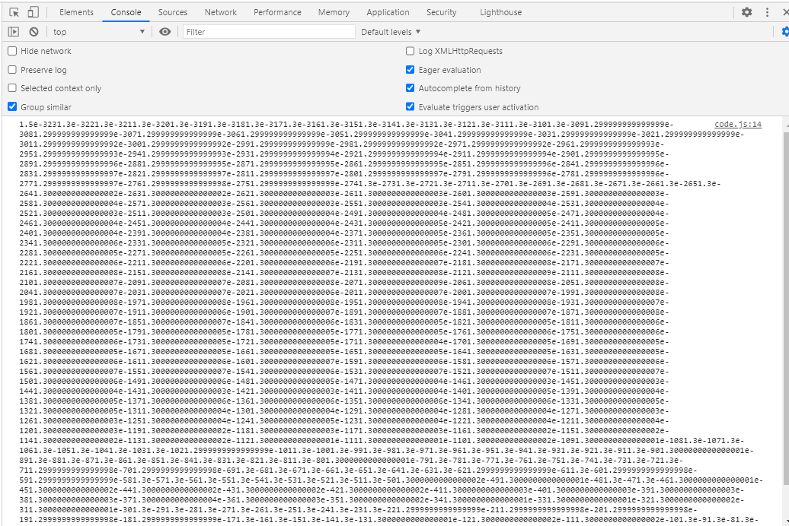

```js
// code.js
function numberToString(n, base) {
    var result = "", sign = "";
    if (n < 0) {
    sign = "-";
    n = -n;
    }
    do {
    result = String(n % base) + result;
    n /= base;
    } while (n > 0);
    return sign + result;
}
console.log(numberToString(13, 10));
// → 1.5e-3231.3e-3221.3e-3211.3e-3201.3e-3191.3e-3181.3…
```

1. 阅读[JavaScript 指南](https://developer.mozilla.org/zh-CN/docs/Web/JavaScript/Guide) 介绍 语法与数据类型 控制流与错误处理 循环与迭代 表达式和运算符

   （1）语法：JavaScript 借鉴了 Java 的大部分语法，但同时也受到 *Awk，Perl* 和 *Python*的影响**区分大小写**的，并使用 **Unicode** 字符集。

   指令被称为语句 （[Statement](https://developer.mozilla.org/en-US/docs/Glossary/Statement)），并用分号（;）进行分隔。如果一条语句独占一行的话，那么分号是可以省略的。（译者注：并不建议这么做。）但如果一行中有多条语句，那么这些语句必须以分号分开。

   Javascript 源码从左往右被扫描并转换成一系列由 token 、控制字符、行终止符、注释和空白字符组成的输入元素。空白字符指的是空格、制表符和换行符等。

   **Javascript 注释**的语法和 C++ 或许多其他语言类似：

   ```
   // 单行注释
   
   /* 这是一个更长的,
      多行注释
   */
   
   /* 然而, 你不能, /* 嵌套注释 */ 语法错误 */
   ```

   在代码执行过程中，注释将被自动跳过（不执行）。

   JavaScript有三种声明方式。

   - [`var`](https://developer.mozilla.org/zh-CN/docs/Web/JavaScript/Reference/Statements/var)

     声明一个变量，可选初始化一个值。

   - [`let`](https://developer.mozilla.org/zh-CN/docs/Web/JavaScript/Reference/Statements/let)

     声明一个块作用域的局部变量，可选初始化一个值。

   - [`const`](https://developer.mozilla.org/zh-CN/docs/Web/JavaScript/Reference/Statements/const)

     声明一个块作用域的只读常量

   一个 JavaScript 标识符必须以字母、下划线（_）或者美元符号（$）开头；后续的字符也可以是数字（0-9）。

   用 `var` 或 `let` 语句声明的变量，如果没有赋初始值，则其值为 `undefined` 。

   如果访问一个未声明的变量会导致抛出一个引用错误（ReferenceError）异常。

   在函数之外声明的变量，叫做*全局*变量，因为它可被当前文档中的任何其他代码所访问。在函数内部声明的变量，叫做*局部*变量，因为它只能在当前函数的内部访问。

   JavaScript 变量的另一个不同寻常的地方是，你可以先使用变量稍后再声明变量而不会引发异常。这一概念称为变量提升；JavaScript 变量感觉上是被“提升”或移到了函数或语句的最前面。但是，提升后的变量将返回 undefined 值。因此在使用或引用某个变量之后进行声明和初始化操作，这个被提升的变量仍将返回 undefined 值。

   你可以用关键字 `const` 创建一个只读的常量。常量标识符的命名规则和变量相同：必须以字母、下划线（_）或美元符号（$）开头并可以包含有字母、数字或下划线。

   常量不可以通过重新赋值改变其值，也不可以在代码运行时重新声明。它必须被初始化为某个值。

   常量的作用域规则与 `let` 块级作用域变量相同。若省略`const`关键字，则该标识符将被视为变量。

   在同一作用域中，不能使用与变量名或函数名相同的名字来命名常量。

   （2）数据类型：

   - 七种基本数据类型:
     - 布尔值（Boolean），有2个值分别是：`true` 和 `false`.
     - null ， 一个表明 null 值的特殊关键字。 JavaScript 是大小写敏感的，因此 `null` 与 `Null`、`NULL`或变体完全不同。
     - undefined ，和 null 一样是一个特殊的关键字，undefined 表示变量未赋值时的属性。
     - 数字（Number），整数或浮点数，例如： `42` 或者 `3.14159`。
     - 任意精度的整数 (BigInt) ，可以安全地存储和操作大整数，甚至可以超过数字的安全整数限制。
     - 字符串（String），字符串是一串表示文本值的字符序列，例如："Howdy" 。
     - 代表（Symbol） ( 在 ECMAScript 6 中新添加的类型).。一种实例是唯一且不可改变的数据类型。
   - 以及对象（Object）。

   (3)控制流

   在JavaScript中，任何表达式(expression)都可以看作一条语句(statement),

   最基本的语句是用于组合语句的语句块。该块由一对大括号界定,

   语句块通常用于流程控制，如`if`，`for`，`while`等等。

   条件判断语句指的是根据指定的条件所返回的结果（真或假或其它预定义的），来执行特定的语句。JavaScript 支持两种条件判断语句：`if...else`和`switch`。

   (4)错误处理

   你可以用 `throw` 语句抛出一个异常并且用 `try...catch` 语句捕获处理它

   JavaScript 可以抛出任意对象。然而，不是所有对象能产生相同的结果。尽管抛出数值或者字母串作为错误信息十分常见，但是通常用下列其中一种异常类型来创建目标更为高效：

   - [ECMAScript exceptions](https://developer.mozilla.org/en-US/docs/Web/JavaScript/Reference/Global_Objects/Error#Error_types)
   - [`DOMException`](https://developer.mozilla.org/zh-CN/docs/Web/API/DOMException) and [`DOMError`](https://developer.mozilla.org/zh-CN/docs/Web/API/DOMError)

   `try...catch` 语句标记一块待尝试的语句，并规定一个以上的响应应该有一个异常被抛出。如果我们抛出一个异常，`try...catch`语句就捕获它。

   `try...catch` 语句有一个包含一条或者多条语句的try代码块，0个或1个的`catch`代码块，catch代码块中的语句会在try代码块中抛出异常时执行。 换句话说，如果你在try代码块中的代码如果没有执行成功，那么你希望将执行流程转入catch代码块。如果try代码块中的语句（或者`try` 代码块中调用的方法）一旦抛出了异常，那么执行流程会立即进入`catch` 代码块。如果try代码块没有抛出异常，catch代码块就会被跳过。`finally` 代码块总会紧跟在try和catch代码块之后执行，但会在try和catch代码块之后的其他代码之前执行。

   (5)循环与迭代

   循环有很多种类，但本质上它们都做的是同一件事：它们把一个动作重复了很多次（实际上重复的次数有可能为 0）。各种循环机制提供了不同的方法去确定循环的开始和结束。不同情况下，某一种类型循环会比其它的循环用起来更简单。

   JavaScript中提供了这些循环语句：

   - [for 语句](https://developer.mozilla.org/zh-CN/docs/Web/JavaScript/Guide/Loops_and_iteration#for_语句)
   - [do...while 语句](https://developer.mozilla.org/zh-CN/docs/Web/JavaScript/Guide/Loops_and_iteration#do...while_语句)
   - [while 语句](https://developer.mozilla.org/zh-CN/docs/Web/JavaScript/Guide/Loops_and_iteration#while_语句)
   - [labeled 语句](https://developer.mozilla.org/zh-CN/docs/Web/JavaScript/Guide/Loops_and_iteration#labeled_语句)
   - [break 语句](https://developer.mozilla.org/zh-CN/docs/Web/JavaScript/Guide/Loops_and_iteration#break_语句)
   - [continue 语句](https://developer.mozilla.org/zh-CN/docs/Web/JavaScript/Guide/Loops_and_iteration#continue_语句)
   - [for...in 语句](https://developer.mozilla.org/zh-CN/docs/Web/JavaScript/Guide/Loops_and_iteration#for...in_语句)
   - [for...of 语句](https://developer.mozilla.org/zh-CN/docs/Web/JavaScript/Guide/Loops_and_iteration#for...of_语句)

   一个 [`for`](https://developer.mozilla.org/zh-CN/docs/Web/JavaScript/Reference/Statements/for) 循环会一直重复执行，直到指定的循环条件为 false。 JavaScript 的 for 循环，和 Java、C 的 for 循环，是很相似的。

   [`do...while`](https://developer.mozilla.org/zh-CN/docs/Web/JavaScript/Reference/Statements/do...while) 语句一直重复直到指定的条件求值得到假值（false）。 

   一个 [`while`](https://developer.mozilla.org/zh-CN/docs/Web/JavaScript/Reference/Statements/while) 语句只要指定的条件求值为真（true）就会一直执行它的语句块.

   一个 [`label`](https://developer.mozilla.org/zh-CN/docs/Web/JavaScript/Reference/Statements/label) 提供了一个让你在程序中其他位置引用它的标识符。例如，你可以用 label 标识一个循环， 然后使用 `break` 或者 `continue` 来指出程序是否该停止循环还是继续循环.

   使用 [`break`](https://developer.mozilla.org/zh-CN/docs/Web/JavaScript/Reference/Statements/break) 语句来终止循环，`switch`， 或者是链接到 label 语句。

   - 当你使用不带 label 的 `break` 时， 它会立即终止当前所在的 `while`，`do-while`，`for`，或者 `switch` 并把控制权交回这些结构后面的语句。
   - 当你使用带 label 的 `break` 时，它会终止指定的带标记（label）的语句。

   [`continue`](https://developer.mozilla.org/zh-CN/docs/Web/JavaScript/Reference/Statements/continue) 语句可以用来继续执行（跳过代码块的剩余部分并进入下一循环）一个 `while`、`do-while`、`for`，或者 `label` 语句。

   - 当你使用不带 label 的 `continue` 时， 它终止当前 `while`，`do-while`，或者 for 语句到结尾的这次的循环并且继续执行下一次循环。
   - 当你使用带 label 的 `continue` 时， 它会应用被 label 标识的循环语句。

   [`for...in`](https://developer.mozilla.org/zh-CN/docs/Web/JavaScript/Reference/Statements/for...in) 语句循环一个指定的变量来循环一个对象所有可枚举的属性。JavaScript 会为每一个不同的属性执行指定的语句。

   [`for...of`](https://developer.mozilla.org/zh-CN/docs/Web/JavaScript/Reference/Statements/for...of) 语句在[可迭代对象](https://developer.mozilla.org/zh-CN/docs/Web/JavaScript/Reference/Iteration_protocols)（包括[`Array`](https://developer.mozilla.org/zh-CN/docs/Web/JavaScript/Reference/Global_Objects/Array)、[`Map`](https://developer.mozilla.org/zh-CN/docs/Web/JavaScript/Reference/Global_Objects/Map)、[`Set`](https://developer.mozilla.org/zh-CN/docs/Web/JavaScript/Reference/Global_Objects/Set)、[`arguments`](https://developer.mozilla.org/zh-CN/docs/Web/JavaScript/Reference/Functions/arguments) 等等）上创建了一个循环，对值的每一个独特属性调用一次迭代。

   (5)运算符

   JavaScript 拥有如下类型的运算符。本节描述了运算符和运算符的优先级。

   - [赋值运算符(Assignment operators)](https://developer.mozilla.org/zh-CN/docs/Web/JavaScript/Guide/Expressions_and_Operators#赋值运算符)
   - [比较运算符(Comparison operators)](https://developer.mozilla.org/zh-CN/docs/Web/JavaScript/Guide/Expressions_and_Operators#比较运算符)
   - [算数运算符(Arithmetic operators)](https://developer.mozilla.org/zh-CN/docs/Web/JavaScript/Guide/Expressions_and_Operators#算术运算符)
   - [位运算符(Bitwise operators)](https://developer.mozilla.org/zh-CN/docs/Web/JavaScript/Guide/Expressions_and_Operators#位运算符)
   - [逻辑运算符(Logical operators)](https://developer.mozilla.org/zh-CN/docs/Web/JavaScript/Guide/Expressions_and_Operators#逻辑运算符)
   - [字符串运算符(String operators)](https://developer.mozilla.org/zh-CN/docs/Web/JavaScript/Guide/Expressions_and_Operators#字符串运算符)
   - [条件（三元）运算符(Conditional operator)](https://developer.mozilla.org/zh-CN/docs/Web/JavaScript/Guide/Expressions_and_Operators#conditional_operator)
   - [逗号运算符(Comma operator)](https://developer.mozilla.org/zh-CN/docs/Web/JavaScript/Guide/Expressions_and_Operators#comma_operator)
   - [一元运算符(Unary operators)](https://developer.mozilla.org/zh-CN/docs/Web/JavaScript/Guide/Expressions_and_Operators#delete)
   - [关系运算符(Relational operator)](https://developer.mozilla.org/zh-CN/docs/Web/JavaScript/Guide/Expressions_and_Operators#关系操作符)

   JavaScript 拥有二元和一元运算符， 和一个特殊的三元运算符（条件运算符）。一个二元运算符需要两个操作数，分别在运算符的前面和后面。

   一个一元运算符需要一个操作数，在运算符前面或后面

   一个 [赋值运算符(assignment operator)](https://developer.mozilla.org/zh-CN/docs/Web/JavaScript/Reference/Operators/Assignment_Operators) 将它右边操作数的值赋给它左边的操作数。最简单的赋值运算符是等于（`=`），它将右边的操作数值赋给左边的操作数。那么 `x = y` 就是将 y 的值赋给 x。

   [比较运算符](https://developer.mozilla.org/zh-CN/docs/Web/JavaScript/Reference/Operators/Comparison_Operators)比较它的操作数并返回一个基于表达式是否为真的逻辑值。操作数可以是数字，字符串，逻辑，对象值。字符串比较是基于标准的字典顺序，使用Unicode值。在多数情况下，如果两个操作数不是相同的类型， JavaScript 会尝试转换它们为恰当的类型来比较。这种行为通常发生在数字作为操作数的比较。类型转换的例外是使用 `===` 和 `!==` 操作符，它们会执行严格的相等和不相等比较。这些运算符不会在检查相等之前转换操作数的类型。

   算术运算符使用数值(字面量或者变量)作为操作数并返回一个数值.标准的算术运算符就是加减乘除(+ - * /)。当操作数是浮点数时，这些运算符表现得跟它们在大多数编程语言中一样（特殊要注意的是，除零会产生[`Infinity`](https://developer.mozilla.org/zh-CN/docs/Web/JavaScript/Reference/Global_Objects/Infinity)）

   位运算符将它的操作数视为32位元的二进制串（0和1组成）而非十进制八进制或十六进制数。例如：十进制数字9用二进制表示为1001，位运算符就是在这个二进制表示上执行运算，但是返回结果是标准的JavaScript数值。

   移位运算符带两个操作数：第一个是待移位的数，第二个是指定第一个数要被移多少位的数。移位的方向由运算符来控制.

   移位运算符把操作数转为32bit整数，然后得出一个与待移位数相同种类的值。

   逻辑运算符常用于布尔（逻辑）值之间; 当操作数都是布尔值时，返回值也是布尔值。 不过实际上`&&`和`||`返回的是一个特定的操作数的值，所以当它用于非布尔值的时候，返回值就可能是非布尔值。 

   除了比较操作符，它可以在字符串值中使用，连接操作符（+）连接两个字符串值相连接，返回另一个字符串，它是两个操作数串的结合。

   [条件运算符](https://developer.mozilla.org/zh-CN/docs/Web/JavaScript/Reference/Operators/Conditional_Operator)是JavaScript中唯一需要三个操作数的运算符。运算的结果根据给定条件在两个值中取其一。

   [逗号操作符](https://developer.mozilla.org/zh-CN/docs/Web/JavaScript/Reference/Operators/Comma_Operator)（`,`）对两个操作数进行求值并返回最终操作数的值。它常常用在 `for` 循环中，在每次循环时对多个变量进行更新。

   一元操作符仅对应一个操作数。

   关系操作符对操作数进行比较，根据比较结果真或假，返回相应的布尔值。

   （6）表达式

   表达式是一组代码的集合，它返回一个值。（译注：定义比较不好理解，看下面的举例就很好懂了。）

   每一个合法的表达式都能计算成某个值，但从概念上讲，有两种类型的表达式：有副作用的（比如赋值）和单纯计算求值的。

   表达式x=7是第一类型的一个例子。该表达式使用=运算符将值7赋予变量x。这个表达式自己的值等于7。

   代码3 + 4是第二个表达式类型的一个例子。该表达式使用+运算符把3和4加到一起但并没有把结果（7）赋值给一个变量。

   JavaScript有以下表达式类型：

   - 算数: 得出一个数字, 例如 3.14159. (通常使用 [arithmetic operators](https://developer.mozilla.org/zh-CN/docs/Web/JavaScript/Guide/Expressions_and_Operators#arithmetic_operators).)
   - 字符串: 得出一个字符串, 例如, "Fred" 或 "234". (通常使用 [string operators](https://developer.mozilla.org/zh-CN/docs/Web/JavaScript/Guide/Expressions_and_Operators#string_operators).)
   - 逻辑值: 得出true或者false. (经常涉及到 [logical operators](https://developer.mozilla.org/zh-CN/docs/Web/JavaScript/Guide/Expressions_and_Operators#logical_operators).)
   - 基本表达式: javascript中基本的关键字和一般表达式。
   - 左值表达式: 分配给左值。

   [`this`](https://developer.mozilla.org/en-US/docs/Web/JavaScript/Reference/Operators/this)关键字被用于指代当前的对象，通常，`this`指代的是方法中正在被调用的对象。

   分组操作符（）控制了表达式中计算的优先级. 举例来说, 你可以改变先乘除后加减的顺序，转而先计算加法。

   左值可以作为赋值的目标。

   你可以使用[`new` operator](https://developer.mozilla.org/en-US/docs/Web/JavaScript/Reference/Operators/new) 创建一个自定义类型或者是`预置类型`的对象实例。

   [super ](https://developer.mozilla.org/en-US/docs/Web/JavaScript/Reference/Operators/super)关键字可以用来调用一个对象父类的函数，它在用来调用一个[类](https://developer.mozilla.org/en-US/docs/Web/JavaScript/Reference/Classes)的父类的构造函数时非常有用

   [扩展语句](https://developer.mozilla.org/en-US/docs/Web/JavaScript/Reference/Operators/Spread_syntax)符允许一个表达式在原地展开， 当需要多个参数 (比如函数调用时) 或者多个值(比如字面量数组) 。

   

2. 阅读教材前言、第一、二章，并在`Nodejs` 和 `Chrome DevTool` 中运行其中的代码

3. http://sigcc.gitee.io/eloquent-js-3e-zh/

4. 完成教材第二章 习题 p23-24 习题 1,2,3

   习题1：

   代码：

   ```js
   // hw1.js
   let i=0
   let str=""
   for(i=0;i<7;i++){
       str+="#"
       console.log(str)
   } 
   ```

   运行结果：

   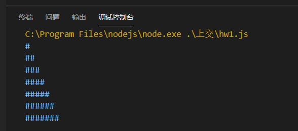

   习题2：

   代码：

      ```js
     // hw2.js
     let i;
     for(i=1;i<=100;i++){
       if(i%3==0){
           console.log("Fizz");
       }else if(i%5==0){
           console.log("Buzz");
       }else{
           console.log(i)
       }
    }
      ```

   运行结果：

   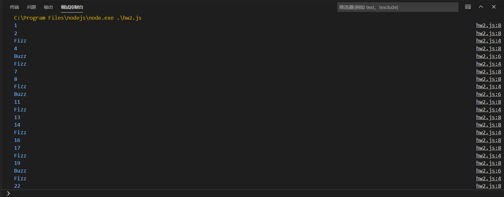

   习题2改进：

   代码:	
   ```js
    // hw2-2.js
    let i;
    for(i=1;i<=100;i++){
   if(i%3==0){
       console.log("Fizz");
   }else if(i%5==0){
       console.log("Buzz");
   }else{
       console.log(i)
   }
   }
   ```

   运行结果：

   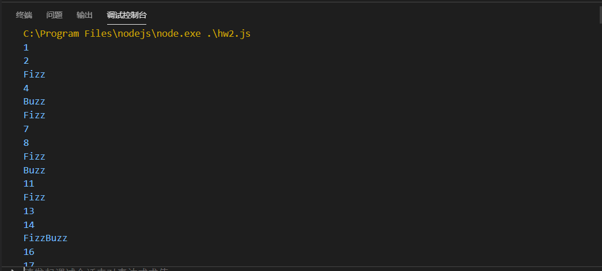

   习题3：
   代码：

   ```js
   // hw3.js
   let size=8;
   for(i=0;i<size;i++){
       let str=""
       for(let j=0;j<size;j++){
         
           if(i%2==0){
               if(j%2==0)
                   str+=" ";
               else
                   str+="#";
           }else{
               if(j%2==1)
                   str+=" ";
               else
                   str+="#";
           }
          
       }
       console.log(str)
   }
   ```
   运行结果：

   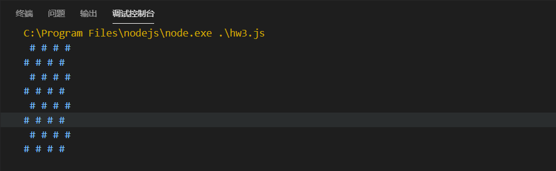

5. 请说明 `var let  const` 在声明变量时的区别

   1.const：用来定义常量，使用时必须初始化，且不能进行修改（定义的对象除外）。

   2.let定义的变量，只能在块作用域里访问，不能跨块访问，也不能跨函数访问。

   3.var定义的变量，可以跨块访问, 不能跨函数访问。

6. 阅读教材 前言，第1章，第2章。结合 像计算机科学家一样思考python.pdf,说明下面的概念
   - 解释器 编译器 		

     解释器：解释器是一种计算机程序，它直接执行由编程语言或脚本语言编写的代码，并不会把源代码预编译成机器码。

     编译器：编译器是一种计算机程序，负责把一种编程语言编写的源码转换成另外一种计算机代码，后者往往是以二进制的形式被称为目标代码。

   - 类型 ：类型可用来解释变量绑定的存储区的内容(二进制编码)的意义。

   - 求值 ：将表达式的内容进行计算并得到运算结果。

   - 表达式：表达式由变量、操作符和方法调用构成并返回一个值结果。

   - 语句：语句大致相当于自然语言中的句子，语句构成一个完整的执行单元。

   - 语法错误：语法错误是指程序的语法有误，编译器或解译器在词法分析时无法将其转换为适当的编程语言。

   - 语义错误：语句语法上没有错误，可以通过编译，也可以运行，也可以得到结果，但结果不符合预期。即为语义描述错误。

7. 给出代码，举例说明JavaScript是动态类型，弱类型

```javascript
// hw4.js
//弱类型：运算时会进行隐式转换，x与3进行计算时，3转换为了string类型'3'
console.log("x"+3);
//output: x3
//动态类型：是运行期间才做数据类型检查的语言，即动态类型语言编程时，永远不用给任何变量指定数据类型。a开始时为number类型，经过赋值后成为了string类型
let a = 18;
a = "haha";
console.log(a);
//output: haha
```

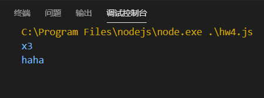

参考阅读：  取自[编程语言傻傻分不清：弱类型、强类型、动态类型、静态类型](https://www.jianshu.com/p/336f19772046)

参考阅读： 代码之髓：编程语言核心概念.pdf