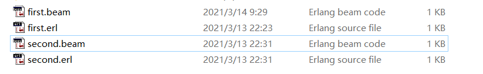

# 2020-21学年第2学期实验1

## **实 验 报 告**

{width="1.5208333333333333in" height="1.5208333333333333in"}

- 课程名称:  <u>编程语言原理与编译</u>
- 实验项目: <u>语言分析与简介</u>
- 专业班级:<u>计算1803</u>
- 学生学号:<u>31801150</u>
- 学生姓名:<u>张帅</u>
- 实验指导教师:<u>郭鸣</u>

### 实验目的

- 掌握编程语言的发展历史
- 编程语言的类型系统、控制结构、模块机制
- 理解编程范式的概念

###  说明

本文档的部分实验截图地址：img文件夹（大部分实验结果采用代码块展示）

本文档的部分实验代码地址：code文件夹（部分在Erlang Shell中直接运行的代码没有备份）

本文档的Erlang版本： V10.4

本文档的实验环境：win10

参考资料：https://www.erlang.org/

​				   https://www.jianshu.com/p/b45eb9314d1e

​                   https://www.cnblogs.com/--00/p/erlang_into_style.html

### 实验内容

- 分析语言：Erlang

- 简要介绍：Erlang是一种通用的**面向并发**的编程语言，其创立者是Joe Armstrong，在1987年由瑞典电信设备制造商爱立信于主持开发。Erlang的开发目的是创造一种可以应对大规模并发活动的编程语言和运行环境，从而简化交换机的开发工作，提高电话交换机的稳定性和可扩展性。

- Erlang的发展历史
          Erlang并非一门新语言，它出现于1987年，Erlang语言创始人Joe Armstrong等当年在爱立信做电话网络方面的开发，其任务是：调查适合下一代电信产品的编程语言。他们对20种语言进行了电信行业的编程实验，结论是：这样的语言需要是一门高度的抽象的语言才能达到生产力目标。Lisp,Prolog,Parlog等语言成为了其目标。

  ​    在他们使用Lisp,Prolog,Parlog等语言进行实验后，得到的结论是：这样的语言需要原生支持的并发控制和容错处理，并且执行模型必须没有使用回溯。（排除了List和Prolog.) 而且它必须拥有并发粒度比如一个异步的电话进程可以用语言的一个进程表示（排除了Parlog）。

  ​	所以最后他们决定开发一门自己的语言，它拥有 Lisp,Prolog和Parlog的特性，但内置了并发和容错处理。Erlang受到了函数语言（比如ML和Miranda），并发语言（比如ADA、Modula、Chill）以及逻辑编程语言Prolog语言的启发和影响。与爱立信专有语言EriPascal和PLEX一样，Smalltalk语言的软件升级特性在Erlang中也得到了深刻的体现。
  
- Erlang语言的编程范式
        Erlang语言是一门**函数式编程语言**，函数式编程是一种编程模型，他将计算机运算看做是数学中函数的计算，并且避免了状态以及变量的概念。 在函数式编程中，函数是基本单位，是第一型，他几乎被用作一切，包括最简单的计算，甚至连变量都被计算所取代。在函数式编程中，变量只是一个名称，而不是一个存储单元，这是函数式编程与传统的命令式编程最典型的不同之处。Erlang的函数写法见下方“Erlang的函数式编程”介绍。
    
- Erlang语言的执行方式

  ​	Erlang是运行于虚拟机的**解释性语言**，但是现在也包含有[乌普萨拉大学](http://baike.baidu.com/view/464772.htm)高性能Erlang计划（HiPE）开发的[本地代码](http://baike.baidu.com/view/3555594.htm)[编译器](http://baike.baidu.com/view/487018.htm)，自R11B-4版本开始，Erlang也开始支持脚本式解释器。Erlang源代码不能直接翻译成机器语言，而是先翻译成中间代码，再由解释器对中间代码进行解释运行，程序在运行时才翻译成机器语言，因而具有良好的平台兼容性。
  
  ​	如图，erl为Erlang的源代码文件，使用c(name)命令变量编译后生成.beam格式文件，即为中间代码，之后可以在Erlang shell中运行编译完成的代码中的函数。
  
  
  
- Erlang语言支持的类型

    ​    Erlang是一门**动态语言**，它支持动态数据类型，动态函数调用，都充分表现的动态语言的特征。在系统运行过程中，可以改变代码结构，现有的函数可以被删除或修改，运行时代码可以根据某些条件改变自身结构，是其热更新的基础。
    
    ​	Erlang是一个运行在虚机里面的动态语言，容易实现软件版本的热升级。动态语言因为时刻要进行类型推导，执行速度就是要比静态语言慢好几倍，所以，erlang自身所做的优化，就是尽可能把常用的功能用c语言实现，集成到erlang的虚机内，至于程序员编写的代码，执行效率就比较低下。


- Erlang语言的数据类型

  ​	Erlang语言是**动态数据类型、强数据类型**的语言，使用时不用给任何变量指定数据类型，其数据类型包含以下几种：

   - 数值(Integer和Float)

     Erlang的数值类型分为整型和浮点型:
     整型数据没有大小限制，较小的3整数会被存放在单个机器字长内，较大的整数会自动按需分配内存。不存在溢出的问题：
     
     ```Erlang
     1> 1234567890 * 987654321 * 999999999.
     1219326309907026378873647310
     ```
     另外，Erlang还支持使用2进制到36进制的整数，如：16#FF00，2#10101，36#ZZ。
     ```Erlang
     2> 16#FF00.
     65280
     ```
     此外，利用$前缀记法可以得到任意字符的数值编码（ascii/Latin-1/Unicode皆可）,如：$9，$z，$\n。
     ```Erlang
     3> $A.  
     65
     ```
     Erlang的浮点数采用双精度，没有单精度的说法，且浮点数不可以用.（英文句号）开头，如：.01，erlang要求必须以数字开头，如：0.01。
     ```Erlang
     4> 0.22212.
     0.22212
     5> .12121.
     * 1: syntax error before: '.'
     ```
     此外，还可以使用指数形式表示浮点数。例如：102.12E-2。
     ```Erlang
     5> 102.12E-2.
     1.0212
     ```
     Erlang语言与大多数编程语言类似，可以进行四则运算( +，-，*，/ ，div)操作，其中/运算的返回值为浮点数，而div运算的返回值为整数类型，除法运算的余数可以使用rem运算获得。此外，可以通过括号（）改变计算的优先级。
     ```Erlang
     1> 1+2.
     3
     2> 2-1.
     1
     3> 1*3.
     3
     4> 10/3.
     3.3333333333333335
     5> 10 div 3.
     3
     6> 10 rem 3.
     1
     7> 1+2*3.
     7
     8> (1+2)*3.
     9
     ```

     可以在算式中混合使用浮点数和整数，结果将被识别为浮点数。但是，如果对浮点数使用求余数操作符，则会产生错误，因为这些操作符只支持整数。
     ```Erlang
     1> 1+2.0.
     3.0
     ```

  - Atom(原子)
    
    Erlang中原子是一种仅由字符序列来标识的特殊字符串常量，两个原子只要具有相同的字符表示，就完全等同。在系统内部，这些字符串存储在某张表内，并由表的下标定位，因此在运行时只要比较两个小整数就可以判断两个原子是否相等。每个原子仅占一个字长的内存，他们的长度上限是255个字符。
    
    Erlang中，无须事先声明原子，可以随意创建并随处使用。通常情况下，原子以小写字母开头，如：ok、error、foo、undefined。 若再用到其他特殊字符，就得给他们加上单引号，如：  ‘￥%#*！’，  ‘Blanks and Capitals can be quoted'。
    
       ```Erlang
    1> ok.
    ok
    2> '&sas***'.
    '&sas***'
       ```
    Erlang中的Boolean数据类型是两个保留原子：true和false。
    
    ```Erlang
    1> 1==1.
    true
    2> 1==2.
    false
    ```

  - Pid(进程标识符)

    Erlang的Pid表示进程标识符，Pid由Erlang的spawn（…）原语创建，Pid是Erlang进程的引用。可以通过self()得到当前进程的Pid，打印格式：<0.35.0>
    ```Erlang
    8> self().
    <0.77.0>
    ```
    
  - Port(端口)
    端口用于与外界通信，由内置函数（BIF3）open_port来创建。消息可以通过端口进行收发，但是这些消息必须遵守所谓“端口协议”（port protocol）的规则。端口的打印格式：#Port<0.472>

  - Reference(引用)
    reference引用是全局唯一的符号，只用来比较两个引用是否相等。引用可以通过调用Erlang原语make_ref()来创造。打印格式为#Ref<0.0.0.39>。引用常被用作各种要求保证唯一性的一次性标签或cookie。
    ```Erlang
  1> make_ref().
  #Ref<0.37964827.2599419906.258321>
    ```
    
  - Fun(函数)
  Erlang中，fun函数就是一个匿名函数，由表达式“fun(…) -> … end.”定义,他自己没有名字，同一个模块中的两个函数，如果她们同名但是它们的目不同，这样的两个函数被认为是完全不同的两个函数。fun既可以作为函数的参数，也可以作为函数（或者自己本身fun）的返回结果。

       ```Erlang
    1> Triple = fun(X) -> 3*X end.
    #Fun<erl_eval.7.91303403>
    2> Triple(3).
    9
       ```
    
  - Bit string(位串) 
    Bit String由一些比特（bit，理解为‘位’）组成，不要求包含的比特数量能够整除8，如果恰好能够整除8的话，那么这个位串就是个binary，Bit Strings代表无类型的内存区域，其提供了一种方法来匹配二进制数据，这使得Erlang二进制对象在某种程度上等同于其他Erlang对象，如元组和列表。也因为其快速高效，使得在Erlang中，二进制对象被广泛使用，尤其是在协议编程方面。，表现形式为<<E1,...,En>>，每个元素Ei指定了一段二进制串（bit string）。每个元素Ei都是一个值，后面可以带有可选参数Size、TypeSpecifierList。
       ```Erlang
    1>  Bin1 = <<1,17,42>>.
    <<1,17,42>>
    2> Bin2 = <<"abc">>.
    <<97,98,99>>
       ```
    Size表示前一个Value数据存储的位数，默认是8位，也就是一个字节。
       ```Erlang
    3> Bin3 = <<1,17,42:16>>.
    <<1,17,0,42>>
       ```
     TypeSpecifierList可以是以下几种类型及其组合，组合以 - 相连
     Type = integer | float | binary | bytes | bitstring | bits | utf8 | utf16 | utf32
    
      ```Erlang
    9> <<G,H/binary>> = <<1,17,42:16>>.
    <<1,17,0,42>>
    10> H.
    <<17,0,42>>
      ```
    
  - Erlang语言的数据特点
    
    Erlang语言是**动态数据类型**的语言，定义变量时，不需要指定其数据类型，运行期间才去做数据类型检查。
      ```Erlang
    1> X = 1.
    1
      ```
    Erlang语言是**强数据类型**，不同的数据类型之间不能进行运算，不过有一个例外，浮点数和整数类型之间允许隐式转换。
      ```Erlang
    1> 1+abc.
  ** exception error: an error occurred when evaluating an arithmetic expression
    in operator  +/2
    called as 1 + abc
  2> 1+2.0.
  3.0
      ```
  
- Erlang语言的复合数据类型

     ​	Erlang语言拥有三种复合数据类型：

     - 元组 
           元组类似于C语言里面的结构体(Struct)，是由固定数量的元素组成的复合数据类型，可以通过模式匹配或者如：element(1,x)的函数来提取元组里面元素的值，也通过如：setelement(1,x,E)的函数来设置元组里面元素的值，size(x)可以取元组里面元素的个数。

       ```Erlang
       1> P = {adam,24,{july,29}}. 
       {adam,24,{july,29}}
       2> element(1,P).
       adam
       3> P2 = setelement(2,P,25).
       {adam,25,{july,29}}
       4> size(P).
       3
       ```
     - 映射组（Map）
           射组(Map) 映射组是一个由多个Key-Vaule结构组成的符合数据类型，可以定义为如下结构：#{Key1=>Value1, Key2=>Value2, …, KeyN=>ValueN}   ， map 随时可以使用，不需要事先定义 map 的结构。
     
       ```Erlang
       1> F1 = #{ a => 1, b => 2 }.
       #{a => 1,b => 2}
       ```
       使用如maps:get(a,F1)函数可以获得指定的映射组的某key的value，使用如 F1#{ a:=2 }或maps:update(a,2,F1)可以修改指定的映射组中的指定key的value的值。使用如 F1#{ a => 3 } 可以修改指定的映射组中的指定key的value的值。使用map_size()可以获得指定map的大小。
       ```Erlang
       1> F4=F1#{ a:=2 }.
       #{a => 2,b => 2}
       2> maps:update(a,1,F1).
       #{a => 1,b => 2}
       3> maps:get(a,F1).  
       1
       4> map_size(F1).
       2
       ```
     - 列表(List) 
           类似于其他语言里面的数组，是由可变数量的元素组成的复合数据结构，可以定义成如下结构：[Term1, Term2, …, TermN]在Erlang里面，列表由一个头和一个尾组成，空列表也是一个列表。列表也可以有一个递归的定义，例如List = [Term| List]。
       
       ```Erlang
     1> L = [1,2,3,4,5,6].
     [1,2,3,4,5,6]
     2> L2 = [8,L].
       [8,[1,2,3,4,5,6]]
       ```
       使用[...] ++ [....]  这将得到两个列表的综合，此外lists模块还提供大量函数对列表进行操作：
       ```Erlang
       1> length(L).
     6
     2> lists:sort(L).
     [1,2,3,4,5,6]
     3> lists:reverse(L).
     [6,5,4,3,2,1]
       ```
       字符串(String) 字符串用一对双引号括起来，但不算是Erlang中的数据类型。字符串仅仅是列表的一个缩写，比如：字符串”hello”是列表[$h,$e,$l,$l,$o]的一个缩写。
     
- Erlang的比较运算
            Erlang的数据可以进行比较，返回true和false，运算如下：

|运算符|描述|类型|
|----|----|---|
|X > Y| 大于Y|coerce|
|X > Y|X 大于Y|coerce|
|X < Y|X 小于Y|coerce|
|X =< Y|X 小于或等于Y|coerce|
|X >= Y|X 大于或等于Y|coerce|
|X == Y|X 等于Y|coerce|
|X /= Y|X 不等于Y|coerce|
|X =:= Y|X 等于Y|exact|
|X =/= Y|X 不等于Y|exact|
​        比较运算符工作机制如下：首先对运算符两边求值（如，在表达式两边存在算术表达式或包含BIF保护式函数时）；然后再进行比较。为了进行比较，定义如下的偏序关系：
​        number < atom < reference < port < pid < tuple < list
​        元组首先按大小排序，然后再按元素排序。列表的比较顺序是先头部，后尾部。
​        如果比较运算符的两个参数都是数值类型且运算符为coerce型，则如果一个参数是integer另一个是float，那么integer将被转换为float再进行比较。exact类型的运算符则不做这样的转换。
​        ​因此5.0 == 1 + 4为真，而5.0 =:= 4 + 1为假。


- Erlang的类型转换
            Erlang提供了一些内置的类型转换函数，可以方便地进行类型转换，下面是一些类型转换的例子:

	```Erlang
1> atom_to_list(hello).
"hello"
2> list_to_atom("hello").
hello
3> binary_to_list(<<"hello">>).
"hello"
4> binary_to_list(<<104,101,108,108,111>>).
"hello"
        5> atom_to_list(hello)
"hello"
        6> list_to_atom("hello").
        hello
        7> binary_to_list(<<"hello">>).
        "hello"
        8> binary_to_list(<<104,101,108,108,111>>).
        "hello"
        9> list_to_binary("hello").
        <<104,101,108,108,111>>
        10> integer_to_list(77).
        "77"
        11> list_to_integer("77").
        77
        12> tuple_to_list({a,b,c}).
        [a,b,c]
        13> list_to_tuple([a,b,c]).
        {a,b,c}
        14> term_to_binary({a,b,c}).
        <<131,104,3,100,0,1,97,100,0,1,98,100,0,1,99>>
        15> binary_to_term(<<131,104,3,100,0,1,97,100,0,1,98,100,0,1,99>>).
        {a,b,c}
        ```
        
- Erlang的变量
             Erlang语言的变量比较特殊，Erlang语言的变量只能一次性赋值，一旦为某个赋值了，那么这个变量的值终身不再改变。
	
    ```Erlang
    1> X=1.
    1
    2> X=2.
    ** exception error: no match of right hand side value 2
    ```
   ​	原因是erlang里面的变量仅仅表示对一个值得引用。就具体实现上而言，一个绑定变量就是一个指针，这个指针指向存放那个值得区域。而那个值永远无法改变。
   
- Erlang的模块（Moudle）

     ​	Erlang真正的代码是写到文件中参与编译的。其使用 Module 组织的。一个 Module 包含了一组函数。调用一个函数的时候，要这么调用：`Module:Function(arg1, arg2)`。或者先 `import` 某个 Module 里的函数，然后用省略Module名的方式调用：`Function(arg1, arg2)`。Module 可也提供代码管理的作用，加载一个 Module 到 Erlang VM就加载了那个 Module 里的所有代码，当想热更新代码的话，直接更新这个 Module 即可。

     ​	定义一个模块时，创建一个erl格式的文件，在文件的第一行, 用 -module(name) 来声明的 module的名字。之后第二行使用export([name/2, name/3])函数决定导出的函数，格式为函数名/函数参数个数。没导出的函数在 Module 外是无法访问的。示例如下：

     ```Erlang
     -module(first).
-export([add/2, add/3]). 
add(A, B) ->
A + B.
  add(A, B, C) ->
A + B + C.
  ```
  
     在模块编写完成后，使用c(name)命令对指定name的erl文件进行编译，生成.bean文件，此时在同一目录下即可调用对应module的函数
   ```Erlang
5> c(first).
{ok,first}
6> first:add(1,2).
3
   ```
  
- Erlang的函数式编程
              Erlang 是一种**函数式编程**语言，函数是其编程的基本单位，并且可以使用变量进行传递。所有的函数、表达式都必须有一个返回值。
          
          - 定义简单的函数 
            	Erlang中函数的定义必须在一个模块内（Module），函数的参数可以是任何的Erlang类型或者数据结构，函数要被跨模块调用需要从模块中导出，函数调用的形式类似：moduleName: funcName(Arg1......).Erlang的函数定义包括三个部分：
  1.函数头：由函数名和被括号括起来的模式构成。函数名是一个原子，模式也可以理解为函数的参数。
  2.分隔符：即“->”;
  3.函数体：由一个或多个表达式组成。函数总是返回最后一个表达式的值，即最后一个表达式的值作为函数的返回值。函数体用“.”表示结束函数定义。
    
    ```Erlang
    -module(first).
    -export([add/2]). 
    add(A, B) ->
    A + B.
    ```
  
  - 多个表达式的函数 
                    	函数体中可以包括了多个表达式，它们之间用“,”隔开，运行函数时，其将分别运行，但是最终只返回最后一个表达式的值
     
     ```Erlang
     模块：
     -module(first).
     -export([add/2,add/1]). 
     add(A, B) ->
     A + B.
     add(A) ->
     A + 2,
     A + 5.
     shell运行结果：
     1> first:add(1).  
     6
     ```
  - 多子句函数 
                    在多子句函数定义时，定义了两个函数，但它们之间是用“;”进行分隔的。而且每个子句都包含单子句函数的三个部分。此函数在定义时，两个子句的函数头中的模式分别为不同的模式，当调用函数时，给出的实际参数会按函数定义的顺序对函数头中给出的模式进行模式匹配，哪个子句匹配成功，则运行哪个子句，若没有一个匹配成功则报错。
     ```Erlang
     模块：
     -module(second).
     -export([choose/1]). 
     choose(a) ->
     1;
     choose(b) ->
     2.
     shell运行结果：
     1> c(second).
     {ok,second}
     2> second:choose(a).
     1
     3> second:choose(b).
     2
     4> second:choose(c).  
     ** exception error: no function clause matching second:choose(c) (second.erl, line 3)
     ```
  
- Erlang语言的模式匹配

  ​	Erlang语言中 = 符号并不是传统语言的赋值符号，= 代表模式匹配，=  运算符的左侧是一个模式，右侧是一个普通表达式，做匹配运算时，首先计算右侧的表达式，得到一个值，接着拿该值去匹配左侧的模式。若匹配失败，则报错，若匹配成功，在左侧模式中出现的所有变量都会与右侧值中的相应组成部分绑定，然后程序将继续计算紧随其后的表达式。
  ```Erlang
  1> {X, 1, 5} = {2, 1, 5}.  
  {2,1,5}
  2> X. 
  2
  3> [H | T] = [1, 2, 3].       %% 使用匹配来解析 List，将第一个元素绑定到 H, 将其余绑定到 T。
  [1,2,3]
  4> H.
  1
  5> T.
  [2,3]
  ```
  
- Erlang语言的控制流机制

  ​	Erlang 是函数式语言，变量不可变的，所以没有 while等循环机制。Erlang拥有if/case和guard等机制：
  - case语句
            	Erlang的case使用case 变量名 of的结构对指定变量的内容进行匹配， 各个分支是自上往下依次匹配的，当符合case内容时，会执行对应的语句，使用 _ 代表可以匹配任意内容，如果case语句中没有一项匹配，则会报错，end语句代表case匹配结束。
      ```Erlang
  模块：
  -module(third).
  -export([greet/1]). 
  greet(Gender) ->
      case Gender of
      	male ->
          		1;
      	female ->
          		2;
      	_ ->
        		3
    end.
  shell运行结果：
  1> c(third).
  {ok,third}
  2> third:greet(male).
  1
    3> third:greet(female).
    2
    4> third:greet(12).    
    3
    ```
    
  - if语句
              Erlang的if表达式的语法如下：
              if
         Guard1 ->
             Sequence1 ;
         Guard2 ->
             Sequence2 ;
          ...
    end
              在这种情况下，保护式Guard1,...将被依次求值。如果一个保护式成立则对与之关联的序列求值。该序列的求值结果便是if  结构的结果。与case相同，一个保护式都不成立的话将引发一个错误。
  	
     ```Erlang
  模块：
  -module(fourth).
  -export([greet/1]). 
  greet(Gender) ->
  if 
  	Gender == male -> 
  1;
  Gender == female -> 
  2
  end.
  shell运行结果：
  1> c(fourth).
  {ok,fourth}
  2> fourth:greet(male). 
  1
  3> fourth:greet(female).
  2
  4> fourth:greet(12).    
  ** exception error: no true branch found when evaluating an if expression
  in function  fourth:greet/1 (fourth.erl, line 4)
     ```
    
   - guard
              Guard 是一种结构，由when和一系列「guard expression」组成，用逗号「,」分隔，是模式匹配的一种扩展，用于提高模式匹配的作用，通过使用 Guard 可以对某个模式里的变量执行简单的测试和比较。
              只有在所有的「guard expression」值为 true 时，guard 才为 true。 语句里 , 表示 and  ; 表示 or。
           
           ```Erlang
           模块：
-module(fifth).
-export([right/1]). 
      right(X) when X>=10,X=<100 -> 
true;
      right(X) when X<10;X>105 ->
      false.
shell运行：
1> c(fifth).
{ok,fifth}
2> fifth:right(10).
true
      3> fifth:right(9). 
	    false
	    ```
	
- Erlang的格式化输入输出

  ​	输出功能非常常用,由于erlang项目没有可断点调试的IDE(或者说根本不需要),所以所有的调试操作都是由io输出来调试的

  ​	io:get_line/1.

  ​    参数:输入提示

  ​    获取标准输入,回车结束,

  ​	io:get_chars/2.

  ​    参数:输入提示,跳过字符数量

  ​    获取输入字符,获取的字符不包含跳过数量的字符

  ​	io:read/1

  ​    参数:输入提示

  ​    从shell面板读取一个项元,项元必须是一个明确的值,而不是一个表达式   

     ```Erlang
  1> io:get_line("请输入").
  请输入1212
  "1212\n"
  2> io:get_chars("请输入",1).
  请输入abs
  "a"
  4> io:read("请输入").
  请输入12.
  {ok,12}
     ```
  
  ​    io:write/1

  ​    打印输出一个项元

  ​	io:format/1

  ​	直接输出一段文本

  ​	io:format/2

  ​    参数:格式化的字符串/二进制,解析列表,列表,列表

  ​    格式化输出一段文本

  ​    格式化的占位符(控制格式化的序列,简称:控制序列)以“~”开头,后面的称之为填充字符
  ​    控制序列表:

|符号|	说明|
|---|---|
|~c	|输出一个字符的ASCII码|
|~f	|输出一个有6位小数点的浮点数|
|~e	|输出一个以科学记数法表示的共6位的浮点数|
|~w	|以标准语法从输出任何项元(也就是Term),常被用于输出Erlang数据类型|
|~p|类似~w,但是会在适当的地方换行和缩进,并尝试将列表作为字符串输出|
|W、P	|类似w和p,但是限制结构深度为3|
|~B	|输出一个十进制整数|
|~n	|换行|
|~s	|打印一个字符串,I/O列表或原子,打印时不带引号|

```Erlang
1> X=12.
12
2> io:write(X).
12ok
3> io:format("122212").
122212ok
4> io:format("hello,world!~n",[]).
hello,world!
ok
```

- Erlang的特点
  - 并发性与轻量级线程
       在Erlang编程语言中，Erlang进程是并发并且独立执行的。在Erlang编程语言中，Erlang进程是有别于操作系统进程的。Erlang的进程是非常轻量的，它有自己的堆栈空间。并且Erlang进程之间是相互独立的，也就是说，每一个Erlang进程都有单独属于自己得堆栈空间，并且完全是私有的，两个Erlang进程之间的堆栈空间不会被共享。如果两个Erlang进程需要进行通信，那么就只能使用发送消息的方式。所以，在Erlang进程的堆空间上就需要有一块区域作为Erlang进程通信的消息邮箱。

   

   ​    上图是Erlang进程堆栈结构的示意图，可以看出，Erlang系统中的每一个进程，都有自己单独的PCB结构，栈空间，已经堆空间。因为Erlang进程轻量的特性，在系统中，就可以维护非常多的Erlang进程，这也是和操作系统进程最大的一个区别。数量众多的Erlang进程，在Erlang虚拟机的调度下，能够尽可能的利用多核计算机，进而为系统提供并发性。

   ​    最后一点需要注意是，Erlang编程语言的并发性，是由Erlang虚拟机提供的，不是操作系统，同样也不是外部库。Erlang编程语言是运行在虚拟机上的，所以它的并发性在所有得操作系统上都有相同的工作方式。

   ​    在Erlang中，可以使用 erlang:spawn/1,2,3,4 用来创建一个 erlang 进程。Erlang 里进程非常轻量，启动速度很快，并且可以同时运行千千万万个，默认的进程个数上限是 262144 。
   ```Erlang
  1> HelloParallel = fun() -> io:format("hello parallel!~n") end.
  #Fun<erl_eval.20.99386804>
  2> spawn(HelloParallel).  %% spawn/1 BIF 接受一个函数做为参数。
  hello parallel!
  <0.63.0>
  3> PID = pid(0,63,0).   %% 使用 pid 来生成一个 PID
  4> is_pid(PID).  %% 检查是否是 PID 类型
  true
  5> is_process_alive(PID). %%  检查 Process 是否还活着。显示 false 是因为它已经运行完成终止了。
  false
   ```
   使用消息发送运算符 ! 发送消息。
   ```Erlang
  4> self() ! "hello".    %% 向自己所在的进程发送一个 List 类型的 "hello". `!` 操作的返回值是消息内容, "hello".
  "hello"
  5> flush().  %% flush() 将当前 process 的信箱里的所有消息清空并打印。
  Shell got "hello"
  ok
   ```
   receive ... end 语句使用模式匹配来从自己进程的信箱里读取消息，可以使用 after 语句来设置等待超时时间：
   ```Erlang
  1> self() ! "msg1".
  "msg1"
  2> self() ! "msg2".
  "msg2"
  3> self() ! "msg3".
  "msg3"
  4> receive Msg -> Msg after 3000 -> no_more end.
  "msg1"
   ```
   - 分布式

     ​    Erlang 的分布式编程可以通过在不同主机上的Erlang 虚拟机（可以运行在同一主机中或可以互相通过网络主机上）实现，其中运行Erlang 虚拟机的主机也称作Erlang 的节点。在Erlang 中，可以实现在一个Erlang 虚拟机上远程在另一个Erlang 虚拟机上创建新的工作的进程，然后利用其消息传递机制，将要计算的数据发送到另一虚拟机上的工作进程，在另一虚拟机中计算后，再使用消息传递机制将计算结果发送回来；也可以实现在一个Erlang虚拟机上以远程调用的方式在远程虚拟机上进行数据处理，并直接返回处理结果。

     ​	有两种办法连接两个 Node。第一种是显式的调用 `net_kernel:connect_node/1`，第二种是在使用 RPC 调用一个远程的方法的时候，自动加入集群。

     ​	使用两个命令行模拟分布式Erlang操作如下：先启动第一个 node，命名为 'node1', 绑定在 127.0.0.1 上。并设置 erlang distribution cookie；再启动一个新的 node2；`erlang:nodes/0` 用来显示与当前建立了分布式连接的那些 nodes。

     

     ​	知道一个 PID，不论他是在本地 node 还是在远端，我们都能用 `!` 发送消息，语义完全一样。如图，在获取了node1的pid之后，node2向node1发送了信息并且成功收到：

     
     
  - 健壮性
        健壮性是Erlang编程语言一个非常重要的特点，Erlang编程语言的健壮性，主要依赖于以下几点：
        Erlang进程资源隔离。在构建可容错的软件系统过程中，要解决的本质问题就是故障隔离，正因为Erlang进程资源隔离的特点，除了几个特殊性的Erlang进程（Erlang系统的主进程如果死掉的话，Erlang系统肯定没法玩了）之外，某个一般性的进程出现错误异常，对整个Erlang系统造成的影响是很小的，因为资源是隔离的，所以某个进程出现的故障具有隔离性，不会导致整个Erlang系统崩溃。

    ​	在Erlang系统中，系统提供了一些错误异常处理的方式，体现在API函数上，这几个API函数都会crash掉调用者进程.
    ```Erlang
    1> erlang:exit("test").
  ** exception exit: "test"
  2> erlang:throw("test").
  ** exception throw: "test"
  3> erlang:error("test").
  ** exception error: "test"
    ```
    ​	为了捕获这些错误异常，Erlang同样提供了非常方便的不同的错误异常处理方式，可以使用catch和try ... catch，使用catch来捕获的话，就可以看出错误异常的类型以及调用栈信息，能让方便快速的定位究竟是哪里出了问题
    ```Erlang
    4> catch 1 + "1".
  {'EXIT',{badarith,[{erlang,'+',[1,"1"],[]},
                   {erl_eval,do_apply,6,[{file,"erl_eval.erl"},{line,661}]},
                   {erl_eval,expr,5,[{file,"erl_eval.erl"},{line,434}]},
                   {shell,exprs,7,[{file,"shell.erl"},{line,684}]},
                   {shell,eval_exprs,7,[{file,"shell.erl"},{line,639}]},
                   {shell,eval_loop,3,[{file,"shell.erl"},{line,624}]}]}}
    ```
    ​	在Erlang系统中，所提倡的方式是，速错，工作进程不成功就成仁，让其他进程来修复错误，尽可能不是用防御式编程，这样做，能够尽快发现错误异常，避免错误异常真到了生产环境下才被发现。
    
    ​	Erlang采用了“监控者进程”机制，Erlang系统提供了link或者是monitor的方式，可以让监控者进程及时发现工作进程的异常故障，进而对异常故障做出相应的处理，速错不是忽略错误异常，而是尽早的发现并修复。如下：先设置当前进程的trap_exit flag，防止link进程死掉牵连当前进程。然后，分别使用spawn_link和spawn_monitor两种方式创建进程，并让创建的进程执行肯定会出现错误异常的函数。等被创建的进程异常退出之后，当前进程就能收到相应的消息，然后就能做出相应的处理了：
    
    ```Erlang
  6> erlang:process_flag(trap_exit, true).
  false
  7> erlang:spawn_link(fun() -> 1 + "1" end).
  <0.43.0>
  8>
  =ERROR REPORT==== 18-Aug-2015::23:53:54 ===
  Error in process <0.43.0> with exit value: {badarith,[{erlang,'+',[1,"1"],[]}]}
  8> flush().
  Shell got {'EXIT',<0.43.0>,{badarith,[{erlang,'+',[1,"1"],[]}]}}
  ok
  9> erlang:spawn_monitor(fun() -> 1 + "1" end).
  =ERROR REPORT==== 18-Aug-2015::23:54:09 ===
  Error in process <0.46.0> with exit value: {badarith,[{erlang,'+',[1,"1"],[]}]}
  {<0.46.0>,#Ref<0.0.0.68>}
  10> flush().
    Shell got {'DOWN',#Ref<0.0.0.68>,process,<0.46.0>,
              {badarith,[{erlang,'+',[1,"1"],[]}]}}
    ok
    ```
    
  - 软实时性

    ​    Erlang具有软实时性，软实时系统是一个柔性灵活的，它可以容忍偶然的超时错误。失败造成的后果并不严重，Erlang软实时的特点主要依赖于：Erlang虚拟机调度机制，内存垃圾回收策略和进程资源隔离。

    ​	Erlang虚拟机使用抢占式调度的机制，保证Erlang系统的高可用性和软实时性。

    ​	Erlang系统垃圾回收策略是分代回收的，采用递增式垃圾回收方式。进程内的数据分为 minor gc（只对年轻一代） 和major gc(所有).在一定的minor gc次数后 或者 没有足够的内存时, 就会促发major gc；同时每个Erlang进程创建之后都会有自己的PCB，栈，私有堆。erlang不知道他创建的进程会用到哪种场合下，所以一开始分配的内存比较小。如果分配的空间不够了，erlang gc会动态调整堆大小以满足需求，如果分配的空间大了，就会收缩堆，回收内存。

    ​	Erlang进程具有资源隔离的特点，因而Erlang内存垃圾回收是以单个Erlang进程为单位的，在垃圾回收的过程中，不会对整个系统造成影响。

  - 热更新
  
    ​	Erlang允许程序代码在运行过程中进行修改，旧的代码逻辑能够被逐步淘汰而后被新的代码逻辑替换，在此过程中，新旧代码逻辑在系统中是共存的，最大程度保证了Erlang系统的运行，不会因为业务更新造成暂停。
  
    ​	erlang每个模块都能保存2份代码，当前版本'current'和旧版本'old'，当模块第一次被加载时，代码就是'current'版本。如果有新的代码被加载，'current'版本代码就变成了'old'版本，新的代码就成了'current'版本。这样，就算代码在热更新，有进程在调用这个模块，执行的代码也不会受影响。热更新后，这个进程执行的代码没有改变，只不过代码被标记成'old'版本。而新的进程调用这个模块时，只会访问'current'版本的代码。而'old'版本的代码如果没有进程再访问，就会在下次热更新被清除。erlang用两个版本共存的方法来保证任何时候总有一个版本可用，这样，对外服务就不会停止。
  
    ​	演示如下，首先定义两个模块，循环打印一项内容
    ```Erlang
    sixth.erl
    -module(sixth).
    -compile(export_all).   
	  -import(seventh, [x/0]).   
	    
    start(Tag) ->   
	      spawn(fun() -> loop(Tag) end).   
	         
	  loop(Tag) ->   
	      timer:sleep(3000),   
	      Val = x(),   
	      io:format("Vsn1 (~p) seventh:x() = ~p~n", [Tag, Val]),   
	    loop(Tag).  
	  
	  seventh.erl
    -module(seventh).   
    -compile(export_all).   
    
    x()->1.
    ```
    让我们启动sixth module,开始循环打印信息：
    ```Erlang
    > sixth:start(one).   
	Vsn1 (one) seventh:x() = 1  
    ```
    之后修改sixth.erl模块打印的信息：
    ```Erlang
    io:format("Vsn2 (~p) seventh:x() = ~p~n", [Tag, Val]), 
    ```
    在命令行中编译sixth.erl: $ erlc sixth.erl，再回到erlang shell中，加载sixth.erl： code:load_file(sixth).  再启动一个新的start()函数后，发现有两个不同的版本在运行
    ```Erlang
    > sixth:start(two).   
    Vsn2 (two) seventh:x() = 1  
    Vsn1 (one) seventh:x() = 1
    ```
   之后使用 code:purge/1，作用是清除old version  清除旧版本版本的sixth，程序不再输出Vsn1的信息
     ```Erlang
    > code:purge(sixth).   
true   
Vsn2 (two) seventh:x() = 1  
Vsn2 (two) seventh:x() = 1  
     ```
    
  - 递增式代码加载
    
    ​	Erlang的库，包括Erlang现有的库以及自己创建的库是运行在Erlang虚拟机外层的。可以在Erlang系统运行的过程中，被加载，启动，停止以及卸载，这些，都是可以人为去控制的。
    
    ​	以控制lager库为演示示例: 可以使用application:load(lager)加载lager库，然后使用application:ensure_all_started(lager) 启动lager库以及lager库所以来的库。start之后，可以使用application:info() 函数，去检查是否已经启动成功。确认started了，再去unload.，然后发现报错了，是因为lager库正在运行，无法unload。
    ```Erlang
$ erl -pa ./ebin -pa ./deps/*/ebin
Erlang/OTP 17 [erts-6.3] [source] [64-bit] [smp:8:8] [async-threads:10] [hipe] [kernel-poll:false] [lock-counting] [dtrace]
Eshell V6.3  (abort with ^G)
1> application:load(lager).
ok
2> application:ensure_all_started(lager).
{ok,[syntax_tools,compiler,goldrush,lager]}
3> 00:11:23.274 [info] Application lager started on node nonode@nohost
    3> application:info().
    [{loaded,[{goldrush,"Erlang event stream processor","0.1.6"},
          {kernel,"ERTS  CXC 138 10","3.1"},
          {lager,"Erlang logging framework","2.0.3"},
          {syntax_tools,"Syntax tools","1.6.17"},
      {compiler,"ERTS  CXC 138 10","5.0.3"},
      {stdlib,"ERTS  CXC 138 10","2.3"}]},
     {loading,[]},
     {started,[{lager,temporary},
           {goldrush,temporary},
           {compiler,temporary},
           {syntax_tools,temporary},
       {stdlib,permanent},
       {kernel,permanent}]},
     {start_p_false,[]},
     {running,[{lager,<0.45.0>},
           {goldrush,<0.38.0>},
           {compiler,undefined},
           {syntax_tools,undefined},
       {stdlib,undefined},
       {kernel,<0.9.0>}]},
 {starting,[]}]
4> application:unload(lager).
{error,{running,lager}}
    5> application:stop(lager).
    =INFO REPORT==== 19-Aug-2015::00:11:57 ===
    application: lager
exited: stopped
type: temporary
ok
    6> application:unload(lager).
    ok
    ```
  
- Erlang的应用领域
  
  ​	Erlang编程语言的定位非常明确，就是用来构建**分布式**、**容错**、**大规模并发**的**软实时**系统。所以Erlang不仅被使用在电信行业，在多种领域内也取得了巨大的发展和使用,如IM/推送领域，广告数据领域，基础设施，金融支付，还有游戏。
  
  - IM/推送 ：WhatsApp、Weibo私信
  - 广告数据：OpenX、AOL ad、Ptengine
  - 基础设施：Riak、Ejabberd、RabbitMQ、RDS
  - 金融支付：融易通、电银
  - 游戏：4399、明朝
  
  ​    Facebook收购的whatsapp主要用的就是Erlang，ejabberd、rabbitmq在Erlang圈也是非常出名的框架级别应用。国内做IM/推送的公司很多了，weibo私信、环信、国美，深圳的云巴等。广告数据领域，国外有OpenX，AOL Ad，国内有ptengine，adsage。Erlang的分布式特性使构建大规模的分布式系统变成非常方便。在基础设施中，Riak作为非常出名的NOSQL，主要就是用Erlang来开发的。在国内的金融支付领域，融易通和上海电银，几乎是Erlang在国内发展的倡导者，为国内培养了一大票Erlang程序员。
  
  ​    Erlang凭借其出色的**并发性**、**分布式**、**容错性**、**软实时**等特点，得到了很多应用领域的青睐和大规模使用。
  
### 实验总结

​		本次实验重点针对Erlang语言进行分析，Erlang语言是一种通用的**面向并发**的**动态类型**的**函数式编程**语言，具有**动态数据类型**和**强数据类型**，Erlang中共有整型（Integer）、浮点型（Float)、原子（Atom）、进程标识符（Pid)、端口（Port）、引用（Reference）、函数（Fun）和位串（Bitstring）8种数据类型以及列表（List)、元组（Tuple）、映射组（Map)三种复合数据结构；Erlang作为一种**解释性**语言的代码都定义在模块（Moudle）中，以erl作为后缀，通过指定命令编译为beam格式，再在Erlang虚拟机中运行；Erlang作为一种**函数式编程语言**具有变量不变的特性，并且只支持if/case和when的控制结构，while和for等循环结构需要使用函数递归实现。Erlang语言具有以下特点：

- **并发性**：Erlang支持超大量级的轻量级并发进程，并且不需要操作系统具有并发机制。

- **分布式**： 一个分布式Erlang系统是多个Erlang节点组成的网络。

- **健壮性**：Erlang具有多种基本的错误检测能力，它们能够用于构建容错系统。

- **软实时性**： Erlang支持可编程的“软”实时系统，使用了用户态抢占式协作线程，同时使用了递增式垃圾收集技术。

- **热代码升级**：Erlang允许程序代码在运行系统中被修改。旧代码能被逐步淘汰而后被新代码替换。在此过渡期间，新旧代码是共存的。

- **递增式代码装载**：用户能够控制代码如何被装载的细节。

因而Erlang在如IM/**推送领域，广告数据领域，基础设施，金融支付，还有游戏等**领域具有广泛的应用。


