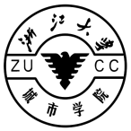
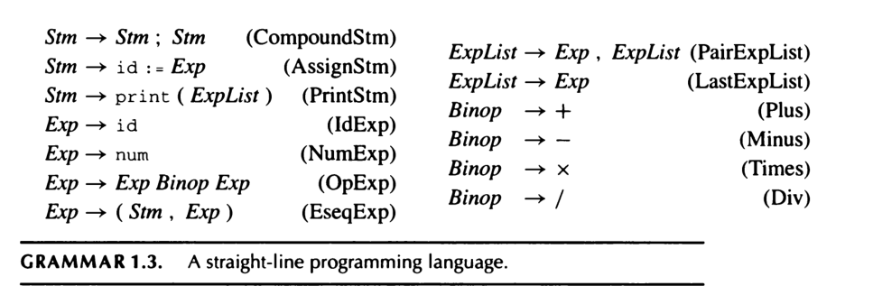
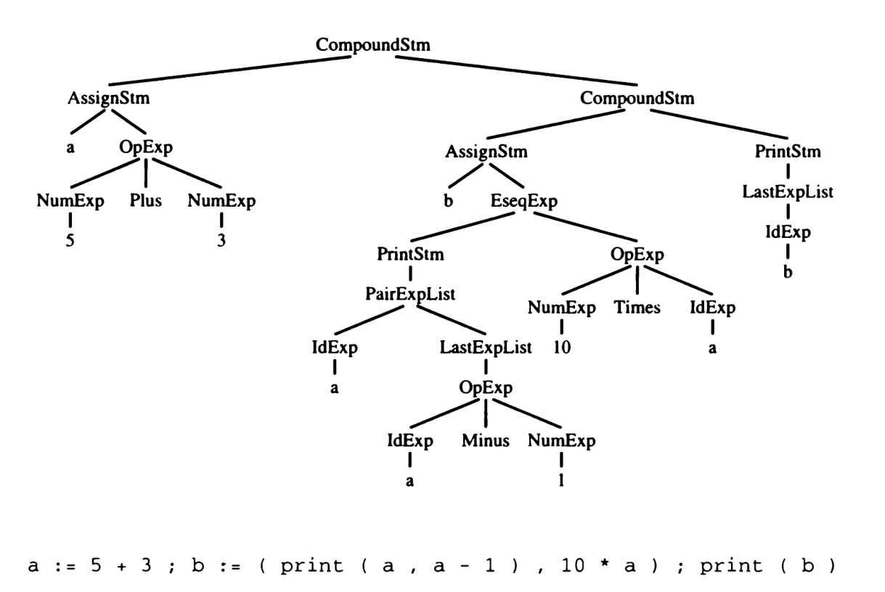

# 2020-21学年第2学期

## 实 验 报 告

{width="1.5208333333333333in" height="1.5208333333333333in"}

- 课程名称: <u>编程语言原理与编译</u>
- 实验项目: <u>编译器入门</u>
- 专业班级: <u>计算1803</u>
- 学生学号: <u>31801150</u>
- 学生姓名: <u>张帅</u>
- 实验指导教师: <u>郭鸣</u>

### 实验目的

- 了解语言的发展历史
- 理解编译的主要阶段
- 掌握基本的编译操作
- 理解高级语言、语法树、 中间语言、机器语言等概念


### 实验内容

1. 阅读课件，请说明下面的概念

    - 编译器，解释器，汇编器

      编译器是一个将一种编程语言的代码翻译(translate)为另外一种编程语言的代码的计算机程序. 通常指将高级语言的代码翻译为低级语言的代码.

      解释器是一种直接执行高级语言代码的计算机程序, 而无需将代码编译成机器码.

      汇编器（Assembler）是将[汇编语言](https://baike.baidu.com/item/汇编语言/61826)翻译为[机器语言](https://baike.baidu.com/item/机器语言/2019225)的程序。

      

    - 编译程序的逻辑过程/步骤

      词法分析、语法分析、语义分析、中间代码生成，代码优化、目标代码生成

      

    - 前端，后端，遍

      •前端包括词法分析、语法分析、语义分析、中间代码产生，以及部分代码优化工作，相关的错误处理和符号表的建立。前端依赖于源程序并在很大程度上独立于目标平台

      •后端主要包括代码优化、代码生成和相关错误处理。后端依赖于目标平台

      •遍是对源程序或源程序的中间结果从头到尾扫描一次，并作有关的加工处理，生成新的中间结果或目标程序。

      

    - 中间语言

      •中间语言是生成源程序的中间表示

      •中间代码是面向抽象机器(VM)的代码

      •易于从语法树生成

      •易于翻译成目标平台的机器语言

      •带语义(注释)的树即为中间代码 

      

    - 机器语言

      机器语言是[机器](https://baike.baidu.com/item/机器/2275865)能直接识别的程序语言或指令代码，无需经过翻译，每一操作码在计算机内部都有相应的电路来完成它，或指不经翻译即可为机器直接理解和接受的程序语言或指令代码。机器语言使用[绝对地址](https://baike.baidu.com/item/绝对地址/573580)和绝对操作码。不同的计算机都有各自的机器语言，即指令系统。从使用的角度看，机器语言是最低级的语言。
      
      

1. 编译命令参数使用
    - 测试`gcc`编译器 `-S -E -c `等参数使用(`-E`预编译 `-S`汇编代码 `-c` 目标代码)

        

        
    
        
    
        
    
        
    
    - https://godbolt.org/ 查看生成的汇编代码
    
        
    
    - 软件平台，建议安装 WSL2
        - [GCC on Windows Subsystem for Linux](https://code.visualstudio.com/docs/cpp/config-wsl)
          - 参考 https://blog.csdn.net/daybreak222/article/details/87968078 ，设置“开发者模式”以及“启用子系统功能”。
          - https://code.visualstudio.com/docs/cpp/config-wsl 参考配置 gcc 以及 VS Code
        - [GCC on Linux](https://code.visualstudio.com/docs/cpp/config-linux)
        - [GCC on Windows](https://code.visualstudio.com/docs/cpp/config-mingw)
          - https://jmeubank.github.io/tdm-gcc/
          - bb 镜像[tdm64-gcc-9.2.0.zip](https://bb.zucc.edu.cn/bbcswebdav/users/j04014/PLC/soft/tdm64-gcc-9.2.0.zip)
        
    - 编辑器推荐使用[vim](http://sigcc.gitee.io/plc2021/#/tools?id=vim)
    
    ```c
    //测试代码如下
    //也可以自行使用其他程序 
    //vi/nano编辑文件test.c
    
    #include <stdio.h>
    
    int main()
    {
        int x;
        scanf("%d", &x);
        x=x+1;
        printf("Value of x:%d\n",x);
    }
    
    ```
    
    `gcc `命令如下
    
    ```sh
    #gcc 命令如下
    
    gcc -E test.c  //预编译
    gcc -S test.c  //汇编代码
    gcc -c test.c  //目标代码
    ```
    
    <内容>
    。。。
    
1. 教材 1.3 图1-2 ，理解 程序代码与抽象语法树（Abstract Syntax Tree）的关系，理解如下的抽象语法树节点
    - 
    - 
    - 语句
      - 复合语句
      - 赋值语句
      - 输出语句
    - 表达式
      - id
      - num
      - 二元操作binop
      - 语句表达式序列 Eseqexp
      - 表达式列表 ExpList （注意与上面的区别）
1. [简单语言解释器](http://sigcc.gitee.io/plc2021/#/02/fsharp.case?id=%e7%ae%80%e5%8d%95%e8%af%ad%e8%a8%80%e8%a7%a3%e9%87%8a%e5%99%a8)
   
    - 程序结构比spl 容易理解，可以先行阅读
1. 查看**具体语法树**`Concrete Syntax Tree` 与 DotNet 中间语言IL 代码、JIT （即时编译）asm 代码的对应关系
   
    - 在线访问 https://sharplab.io/ 查看下面的C#、F#程序，理解如下知识点
      
      
      
      
      
      
      
      
      
      
      
      
      
      - 具体语法树
        - 理解源代码与具体语法树节点的对应关系
        - 关键字，标识符，方法，参数，操作符，操作数
      
    - 参考题目3的图，画出 `int x = 12 * 30;`的抽象语法树   
      
                                 
      
      - 叶子节点有几个 4个
  - 中间语言IL
    
    - 查看中间语言含义，理解运算栈，局部变量的表示
    
      
    
      
    
      
    
      
    
  - 汇编码 JIT Asm
    
       
       
       
       
       
       
       - 理解汇编码与中间语言的关系
       - 理解代码优化的概念

   ```csharp
   //简单的C#程序
using System;
class Test                        // Class declaration
{
    static void Main()              //   Method declaration
 {
     int x = 12 * 30;              //     Statement 1
        Console.WriteLine (x);        //     Statement 2
 }                               //   End of method
}
//简单的 F# 程序，对比C#的语法树结构
let x = 12 * 30
    printf x
   //简单的 F# 程序，带递归    
   let rec fact n = 
    if n = 0 then 1 else n * fact (n - 1)
   //较复杂的 C# 程序
   using System;
   public class Fibonacci
   {
    public static long Fib(int m)
    {
        if (m == 0) return 1;
        else if (m == 1) return 1;
     else return Fib(m - 1) + Fib(m - 2);
    }
 public static void
        Main(string[] args)
    {
        int m = Convert.ToInt32(args[0]);
        System.Console.WriteLine(Fib(m) + "\n");
    }
   }
   ```

6. 下载[LinqPad](https://bb.zucc.edu.cn/bbcswebdav/users/j04014/PLC/soft/LINQPad%206.9.15%20Premium.zip)查看C#代码的具体语法树与抽象语法树 （自选）

    请说明具体语法树，与抽象语法树的区别

    <内容>

    。。。

7. 编译与反编译Java代码 (自选)

    ```java
    //自行安装 jdk 。。可以使用 javac, javap 代码如下:
    //Fibonacci.java
    public class Fibonacci {
        public static long fib(int m) {
            if (m == 0) return 1;
            else if (m == 1) return 1;
            else return fib(m - 1) + fib(m - 2);
        }
        public static void
            main(String[] args) {
            int m =Integer.parseInt(args[0]);
            System.out.println(
                fib(m) + "\n");
        }
    } 
    ```
    ```sh
       #编译Java字节码
       #生成 Fibonacci.class        
       javac Fibonacci.java
    
       #反编译字节码
       javap –c Fibonacci.class
    ```
    <内容>

    

1. 配置 Python 使用反编译dis模块,反编译Fibonacci.py(自选)

    ```python
    >>> import dis
    >>> def f(x):
    ...     return x + x
    ...
    >>> dis.dis(f)
      2           0 LOAD_FAST                0 (x)
                  3 LOAD_FAST                0 (x)
                  6 BINARY_ADD
                  7 RETURN_VALUE
    >>>
    ```
    请参考上面的代码,自己写出 Python 的 Fibonacci.py的代码，并反编译
    
    ```python
    import dis
    def f(x):
         if (x == 0): 
             return 1
         elif (x == 1): 
            return 1
         else :
             return f(x - 1) + f(x - 2)
    
    dis.dis(f)
    ```
    
    
    
    
    
1. 期末的作业项目，自己下载，构建，并运行，理解 解释器，编译器的概念
    - 仓库 https://gitee.com/sigcc/plzoofs.git  进入 [microc](https://gitee.com/sigcc/plzoofs/tree/master/microc) 目录
    - 参考[ReadME.md](https://gitee.com/sigcc/plzoofs/blob/master/microc/ReadME.md)
      
  - 完成 `A.1 B.1 D.1` 
      
        A
      
        
      
        
      
        B
      
        
      
        
      
        D
      
        
      
        
    
10. 思考你打算实现一个什么语言的？ `c java python ml scheme`...

    - 这个语言有什么特性？

        C语言：
      　　1. 简洁紧凑、灵活方便

      　　C语言一共只有32个关键字,9种控制语句，程序书写自由，主要用小写字母表示。它把高级语言的基本结构和语句与低级语言的实用性结合起来。 C 语言可以象汇编语言一样对位、字节和地址进行操作, 而这三者是计算机最基本的工作单元。

      　　2. 运算符丰富 

      　　C的运算符包含的范围很广泛，共有种34个运算符。C语言把括号、赋值、强制类型转换等都作为运算符处理。从而使C的运算类型极其丰富表达式类型多样化，灵活使用各种运算符可以实现在其它高级语言中难以实现的运算。

      　　3. 数据结构丰富

      　　C的数据类型有：整型、实型、字符型、数组类型、指针类型、结构体类型、共用体类型等。能用来实现各种复杂的数据类型的运算。并引入了指针概念,使程序效率更高。另外C语言具有强大的图形功能, 支持多种显示器和驱动器。且计算功能、逻辑判断功能强大。 

      　　4. C是结构式语言

      　　结构式语言的显著特点是代码及数据的分隔化,即程序的各个部分除了必要的信息交流外彼此独立。这种结构化方式可使程序层次清晰, 便于使用、维护以及调试。C语言是以函数形式提供给用户的,这些函数可方便的调用,并具有多种循环、条件语句控制程序流向,从而使程序完全结构化。 

      　　5. C语法限制不太严格、程序设计自由度大 

      　　一般的高级语言语法检查比较严，能够检查出几乎所有的语法错误。而C语言允许程序编写者有较大的自由度。

      　　6. C语言允许直接访问物理地址，可以直接对硬件进行操作

      　　因此既具有高级语言的功能，又具有低级语言的许多功能，能够象汇编语言一样对位、字节和地址进行操作,而这三者是计算机最基本的工作单元，可以用来写系统软件。 

      　　7. C语言程序生成代码质量高，程序执行效率高 

      　　一般只比汇编程序生成的目标代码效率低10へ20%。

      　　8. C语言适用范围大，可移植性好

      　　C语言有一个突出的优点就是适合于多种操作系统, 如DOS、UNIX,也适用于多种机型。

       

      

    - 

      


### 提交方式

- 打包zip上传到bb

- 实验报告采用Markdown格式

- zip内容包括Markdown文本、代码、部分体现实验过程的典型截屏(.png格式)

  

